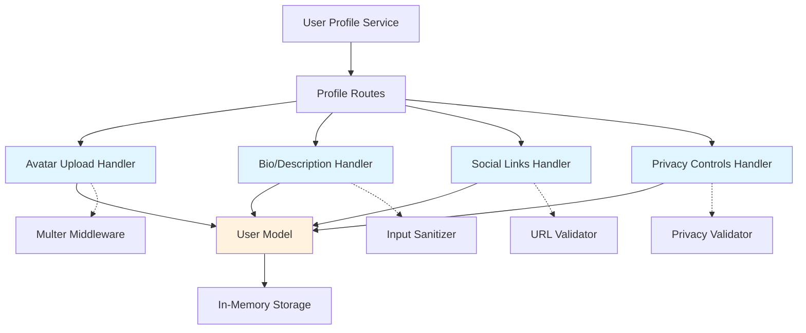

# User Profile Enhancement - Technical Breakdown

## Architecture Diagram

## Implementation Strategy

This feature will be implemented as 4 parallel tickets, each adding independent functionality to the user profile system. All tickets modify different parts of the codebase to avoid merge conflicts.

### Files to Modify
- `src/models/User.js` - Add new fields to User model
- `src/routes/profile.js` - Add new route handlers

## Ticket Breakdown

### Ticket 1: Avatar Upload System
**File:** `src/routes/profile.js`
**Epic:** User Profile Enhancement
**Priority:** P1

**Description:**
Implement avatar upload functionality using multer middleware to handle file uploads and store avatar URLs in user profiles.

**Acceptance Criteria:**
- [ ] POST /api/profile/:userId/avatar endpoint created
- [ ] File upload handling with multer configured
- [ ] Avatar URL stored in user model
- [ ] Basic image format validation (jpg, png, webp)
- [ ] Returns updated user profile

**Technical Notes:**
- Use multer for file upload middleware
- Store avatar URL as string in user object
- Maximum file size: 5MB

---

### Ticket 2: Bio/Description Field
**File:** `src/models/User.js` and `src/routes/profile.js`
**Epic:** User Profile Enhancement
**Priority:** P1

**Description:**
Add biographical description field to user profiles with validation and sanitization.

**Acceptance Criteria:**
- [ ] User model extended with `bio` field
- [ ] PUT /api/profile/:userId/bio endpoint created
- [ ] Character limit validation (500 chars)
- [ ] Basic input sanitization
- [ ] Bio returned in profile GET requests

**Technical Notes:**
- Bio field defaults to empty string
- Trim whitespace
- Prevent script injection

---

### Ticket 3: Social Links Section
**File:** `src/routes/profile.js`
**Epic:** User Profile Enhancement
**Priority:** P1

**Description:**
Enable users to add social media links with URL validation.

**Acceptance Criteria:**
- [ ] PUT /api/profile/:userId/social-links endpoint created
- [ ] Support for multiple social platforms (twitter, linkedin, github)
- [ ] URL format validation
- [ ] Social links stored as object in user profile
- [ ] Returns updated user profile

**Technical Notes:**
- Store as object: {twitter: "url", linkedin: "url", github: "url"}
- Basic URL validation (http/https)
- Empty strings allowed for removal

---

### Ticket 4: Privacy Controls
**File:** `src/routes/profile.js`
**Epic:** User Profile Enhancement
**Priority:** P1

**Description:**
Implement privacy settings to control profile visibility.

**Acceptance Criteria:**
- [ ] PUT /api/profile/:userId/privacy endpoint created
- [ ] Support for privacy levels: public, private, friends-only
- [ ] Privacy setting stored in user profile
- [ ] Default to "public" for existing users
- [ ] Returns updated user profile

**Technical Notes:**
- Privacy field is enum: ["public", "private", "friends-only"]
- Default value: "public"
- Privacy validation on update

## Dependencies
- None - all tickets can be implemented in parallel
- Each ticket modifies different aspects of the codebase
- Minimal merge conflicts expected

## Testing Strategy
- Unit tests for each endpoint
- Integration tests for profile CRUD operations
- Validation tests for each feature

---

**Created:** 2025-10-25
**Agent:** senior-engineer (simulated)
